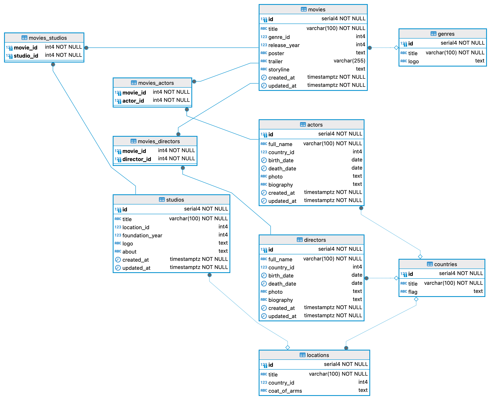

# SERVER

<p align="center">
  
</p>

<p align="center">
  
</p>

## Project Description

Cinema manager server is a project that implements the ability to store and organize information about movies, actors, directors, and studios. It allows users to store and view information about actors and directors, as well as view movie storylines and trailers.

## Entity Relationship Diagram

<p align="center">
  
</p>

## Key Features and Highlights

This project includes 4 main entities and 3 secondary entities.

- **Main Entities**:

  - **Actors**: Information about actors
  - **Directors**: Information about directors
  - **Movies**: Information about movies
  - **Studios**: Information about studios

- **Secondary Entities**:
  - **Genres**: Movie genres
  - **Countries**: Countries
  - **Locations**: Locations

Full CRUD functionality is implemented for all entities.

## Technologies and Libraries

The server-side project is built using the Express framework. The following libraries and middleware are used:

- **cors**: To handle cross-domain requests.
- **http-errors**: To handle and display errors.
- **sequelize & sequelize-cli**: For interacting with the database, along with the **pg** and **pg-hstore** drivers.
- **yup**: For validation.
- **moment**: For date handling.
- **dotenv**: For environment variable management.

Middleware includes:

- **errorHandlers**: For error handling and display.
- **validate**: For validating incoming data with pre-written validation schemas.
- **paginate**: For pagination.
- **time**: For formatted console output.

## Database Interaction

Sequelize is used for database interaction, with models, migrations, and seeders defined for initial data population. Controllers are written to handle client interactions with the database through this server.

## System Requirements

- **Git**: 2.46
- **NodeJS**: v18.20
- **NPM**: 10.8
- **PostgreSQL**: 16

## Installation

1. Clone the repository:
   ```bash
   git clone git@github.com:sytnikovzp/Cinema-manager-server.git
   ```
2. Navigate to the project directory:
   ```bash
   cd Cinema-manager-server
   ```
3. Install dependencies:
   ```bash
   npm i
   ```

## Config .env variables

Use the `.env.example` as reference to create your configuration file `.env`

```yaml
PORT=5000
DB_PORT=5432
DB_USER=postgres
DB_PASS=root
DB_NAME=cinema_manager
DB_HOST=localhost
STATIC_PATH=public
```

## Database Initialization

1. **Creating Tables and Relationships**:

   ```bash
   npm run dbcreate
   ```

2. **Run migrations & Seeding the Database**:

   ```bash
   npm run initial
   ```

## Start server

```bash
npm start
```

## Client-Side Links

- [CINEMA MANAGER client (with Vite)](https://github.com/sytnikovzp/Cinema-manager-client)
